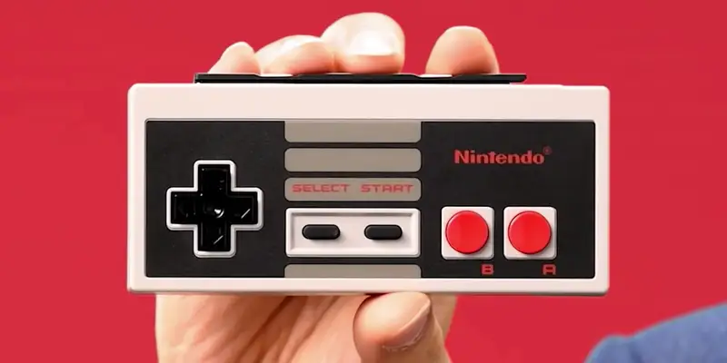

# NES emulator

This is a desktop application written in standard web technology and electron framework used to play games for Nintendo Entertainment System.

I started writing this program from the 8th of August 2022.

# Features

The program is written in about 6 days, so at the moment, only a handful of basic and core essential functionalities are covered.

- Load and play NES games in iNES format
- Run on both the web and in electron 
- Drag and drop game file to play

I also intended to add these features when I have the time.

- GUI for re-mappable keymap
- Setting to change NES emulator engine
- Setting to mute or enhance audio
- Setting to set display filter
- ...

# Running project

1. Clone project into local machine

2. Download all dependencies

   ```console
   yarn
   ```

3. Run the project

   ```
   yarn start
   ```

Executables are not available at the moment.

# How to play

1.  Get ROM file for NES game

    This project run the game using iNES format. You can read more about iNES [here](https://www.nesdev.org/wiki/INES).

    For legal reason, no ROM files are included in this repo. You can extract ROM file from physical cartridge. There are several tutorials on how to do this, such as [this one](https://www.retrogameboards.com/t/the-ripping-thread-how-to-build-your-own-legit-retro-rom-library/98/1)

2. Run the program 

    ```console
    yarn start
    ```

3. Load the game into the program 

    The program supports two ways to load the game
    - Drag and drop ROM file onto the program screen

        

    - Pick from file open dialog (or using shortcut Ctrl+O / Cmd+O)

        

    After loading, the screen will change to something like this

    

4. Play the game

    These are buttons available on the original NES.

    

    The emulator mapped these buttons with computer keys as listed below

    
    | key          | joypad |
    |--------------|--------|
    | enter        | start  |
    | space        | select |
    | cursor-left  | left   |
    | cursor-up    | up     |
    | cursor-right | right  |
    | cursor-down  | down   |
    | s            | A      |
    | a            | B      |

    You can also reconfigure the mapping to your liking, this will be mentioned in later section. 

5. Close game

    You can close game by choosing *Close* in Menu bar or using shortcut Ctrl+W (Cmd+W for MacOS users)

# Customize keymap

There are no GUI settings to change keymap at the momment. But, it can be reconfigured by tweaking directly in the code.

All the functions used to change keymap are located in [keymap.js module](src/scripts/keymap.js)

Each of these customization functions takes a keycode and a keymap and then return a new customized one. 

Example:

```js
const newKeymap = customizeA(83)(defaultKeymap);
```

In this example, we use *customizeA* to change mapping to button A from X in default keymap to S

To customize multiple buttons, I recommend using *compose* function from [utilites module](src/scripts/utilities.js) first before modifying the keymap

```js
const customizeKeymap = compose(customizeA(83), customizeB(65));
const customKeymap = customizeKeymap(defaultKeymap);
```

# Development journey

## Why did I choose this project 

When start working on this project, I wanted to do something 
different from watch I normally used to do. It should be fun, challenging and force me to learn new things. So in this project, I decided to not write web app, which I'm quite accustomed to. I'm also a fan of retro games, especially Japanese Role Playing Games titles like "The legend of Zelda", "Final Fantasy" or "Dragon Quest". I actually thought about writing a new game. However, this project had to be done in less than 10 days. So I ended up getting rid of the idea of writing a whole new game and chose to make an emulator instead. The NES was chosen because this system is fairly easy to emulate. Moreover, the NES has a huge amount of good documents and communities devoted to it, which make it pretty simple to reference some complicated technical details. 

I also used this project as an opportunities to learn more about functional programming, which I have been interested in for a long time. 

## Resources I used to learn 

- [Nesdev Wiki](https://www.nesdev.org/wiki/Nesdev_Wiki) - a websites contains all the resources you need to know about the NES

- [Writing NES Emulator in Rust](https://bugzmanov.github.io/nes_ebook/) - a simple tutorial to write a simple NES emulator using rust programming language

- [Mostly Adequate Guide to Functional Programming](https://mostly-adequate.gitbook.io/mostly-adequate-guide/) - a fantastic book about functional programming concept in JavaScript

- [Electron official documentation](https://www.electronjs.org/docs/latest)

- ... and of course, Google.

## How I started

At first, I intended to write my own emulator without relying on any third-party codebases. However, after 2 days of intense coding, I realised this idea maybe a bit too ambitious. I have written emulator for chip-8 before. But honestly, I could not predict that the NES 6502 CPU (actually it is RP2A03) is actually much more complex than I have thought, and I may not finished the project on time. Therefore, I abadoned all the NES code and opt for a third party solution instead. So after wandering the internet for a while, I found the nes-js by takahirox to be quite simple to use. So I chose this as a base for my project.

I started writing by making a simple web-based version first. And from that, I iteratively adding more functionalities and complexities while researching new techniques to make my code more manageable.

I also planned to make a re-configurable keymap from start. I even wrote all the code needed. But eventually, I removed it for simpler and shorter development.

## Final result

Here are some gameplay I captured from my program


This project is still quite a bit primitive. There are stil bugs I need to fix, performance issues I have to solve, and a lot of "cool" features I want to implemented. But overall, I actually got a lot of satisfaction while working project. That is also the reason while I didn't commit like normal, by features added, and committed by each working session, in order to not disrupt my flow state.